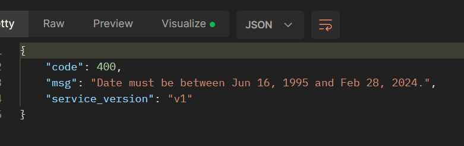
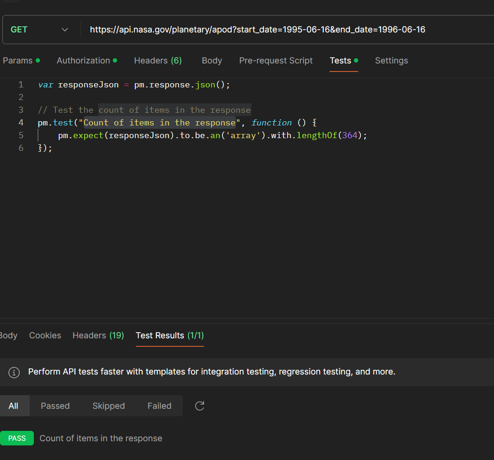

## Задание первое
#### 1. Определите первый HTTPS-запрос, отправленный к домену ylab.io.   В ответе укажите стартовую строку данного запроса.

#### 2. У вкладки “О компании” (https://drive.google.com/file/d/1fSPgT9usn6gEBGcQcnKaBlcWuJkBI-88/view?usp=sharing)   определите цвет используемого шрифта. В ответе укажите его в формате r,g,b.

Ответ:   

### 1.1 `GET https://ylab.io/ HTTP/2`  
### `Host: ylab.io`  

### 2.1 `rgb(10, 184, 182)`

## Задание второе 
#### Определить для API https://api.nasa.gov/planetary/apod следующие данные:

#### 1. Минимально возможное валидное значение параметра date.   Ответ в формате YYYY-MM-DD.

#### 2. Укажите количество записей, возвращаемых в ответе на запрос к указанному API,   за период, начало которого - это ответ из пункта 1 данной задачи, а конец - 16 июня 1996 года.

### 1.1 `1995-06-16 - минимальное возможное валидное значение`   
### 2.1 `Колличество = 364` 

>[!NOTE] 
> Путем пользовательской ошибки `400` был определен диапозон значений

  

>[!NOTE] 
> Через скрипт было подсчитано кол-во записей

  

## Задание третье 
К какому виду идентификаторов ресурсов в сети относится https://www.yandex.ru/search/?text=test

Ответ: 

URI — имя и адрес ресурса в сети, включает в себя URL и URN;

## Задание четвертое 

Верно ли утверждение, что структура HTTP-запроса равна структуре HTTP-ответа.

Ответ: Верно, структура запроса/ответа одинакова, но различие кроется в стартовой строке,  
где в запросе вводится метод и URI, а в ответе — код состояния и пояснение. В остальном по структуре они похожи  
так же в середине у обоих могут быть хэдеры (не всегда), и в конце тело (не всегда) 

## Задание пятое 
Должен ли http-ответ содержать заголовок Host.

Ответ:

Нет. Это относится к http запросу

